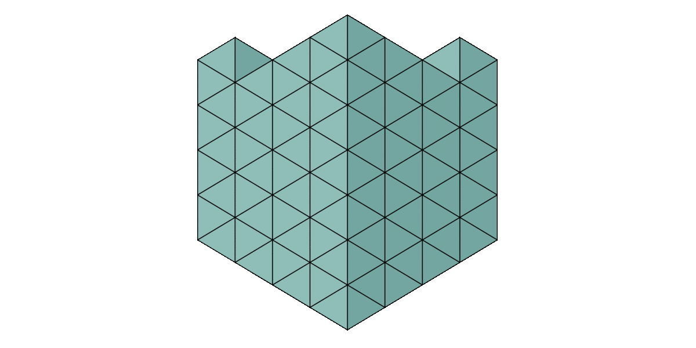
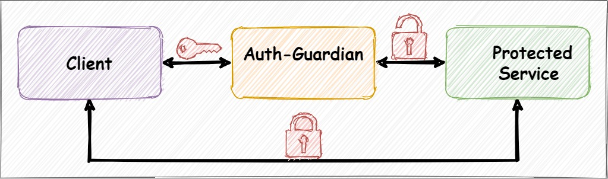

# Auth-Guardian

<table><tr>
<td>
Auth-Guardian is an <b>auth</b>entication and rules based <b>auth</b>orization reverse proxy.
Authentication is provided via generic OAuth and generic SAML.
Authorization (not implemented yet) should be rule-based and as flexible as possible.
</td>
<td>
  
</td>
</tr></table>

The documentation is located [here](doc/DOC.md), changelog [here](doc/CHANGELOG.md) and the contribution guidelines [here](doc/CONTRIBUTING.md).

## Roadmap
### 0.4.5
- Mock oauth
### 0.4.6
- Mock saml
### 0.4.7
- Mock ldap
### 0.4.8
- Implement tests
- Add tests to makefile (local test)
### Release Alpha-0.4.8 
### 0.4.9
- More beautiful html redirect and 403 page
### 0.4.10
- Create docker image
### 0.4.12
- Include Codecov
### Release Beta-0.5.0
### Some improvements...